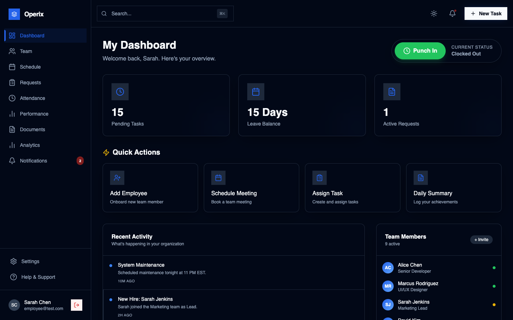
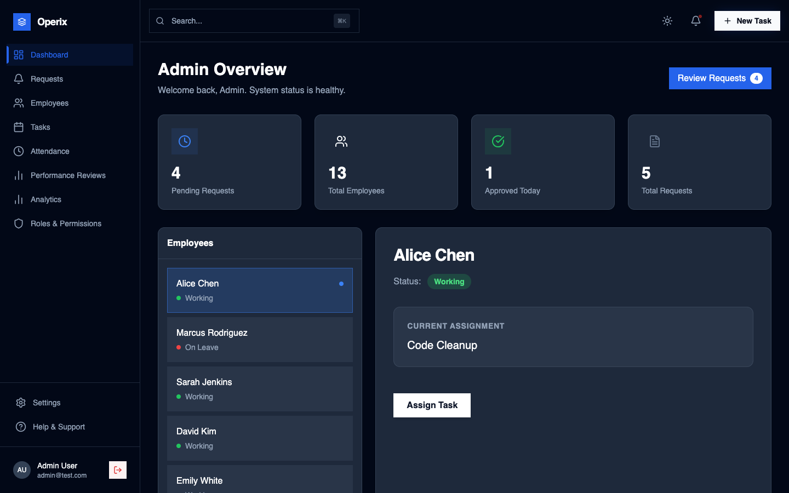
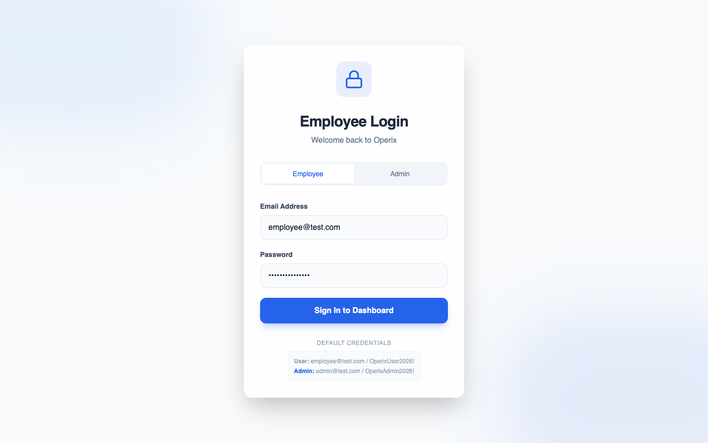

# HR Management System

This is a full-stack human resources platform I built to make managing teams much simpler. It gives administrators and employees separate portals where they can handle daily tasks, check schedules, and submit time-off requests without the usual email clutter.

## Project Overview

The core goal of this app is to strip away the friction from basic HR tasks. Instead of jumping between different calendars and spreadsheets, everything is centralized here. Employees can log on to see what they need to do for the week, and admins get a top-level view of who is working on what, along with any pending requests they need to approve. It's built to be fast, responsive, and easy to use.

## Key Features & Screenshots

I wanted the interface to look clean and feel intuitive. Here is a breakdown of the main parts of the app:

### 1. Unified Dashboard
When you log in, this is the first thing you see. It provides a quick snapshot of the day's priorities, recent announcements, and any outstanding requests. 



### 2. Task & Event Scheduling
The scheduling system is designed so that nothing falls through the cracks. You can see your calendar for the week, assign priorities, and even block tasks if you're waiting on someone else.


### 3. Request Management
Instead of back-and-forth messaging, employees can submit requests (like time off or equipment needs) directly through the portal. 


### 4. Admin Portal
Admins have a completely different view. They can see everyone's schedules combined, approve or deny requests with a click, and manage users.



### 5. Secure Login
A straightforward login page that seamlessly directs you to the correct portal based on your assigned role.



## Tech Stack

Here's what I used to build it:

**Frontend:**
- React / Next.js (using Vite for the build)
- Tailwind CSS for all the styling
- React Router for navigation
- Lucide React for icons

**Backend:**
- Node.js
- Express.js
- CORS

**Database:**
- Right now it uses a fast In-Memory Store, but it's structured so I can easily swap in PostgreSQL or MongoDB later.

## System Architecture & API Flow

The app is split into a standard client-server model:
1. The **React Frontend** handles all the user interaction and presentation.
2. It sends HTTP requests to the **Node.js/Express Backend**.
3. The backend processes the business logic (like checking if you're actually an admin) and talks to the **Database**.
4. The requested data is sent back to the frontend as JSON.

*Flow: User → Frontend → Backend → Database*

## API Endpoints

Here are a few examples of how the routes are set up on the backend:

**Users & Team**
- `GET /api/team` (Gets the company directory)
- `POST /api/team` (Adds someone new)

**Tasks**
- `GET /api/tasks` (Fetches assigned tasks)
- `POST /api/tasks` (Creates a task)
- `PATCH /api/tasks/:id` (Updates the status of a specific task)

**Requests**
- `GET /api/requests` (Gets all employee requests)
- `POST /api/requests` (Submits a new request)
- `PATCH /api/requests/:id` (Approves/denies a request)

## Folder Structure

I keep the frontend and backend completely separated so it's easier to maintain and deploy:

```text
hr-management-system/
│
├─ frontend/          # The React UI folder
├─ backend/           # Node.js Express server
├─ public/            # Static assets
├─ screenshots/       # Images for this README
└─ README.md          
```

## Installation

If you want to run this locally, clone the repo and install the dependencies for both sides:

```bash
# Install the frontend
cd frontend
npm install

# Install the backend
cd ../backend
npm install
```

## Running the Project

You'll need two terminals open to run both the frontend and backend at the same time.

**Start the Frontend:**
```bash
cd frontend
npm run dev
```

**Start the Backend:**
```bash
cd backend
npm start
```

## Future Improvements

- Hooking up a real database (probably MongoDB).
- Adding full JWT/OAuth authentication so users don't just log in via hardcoded demo accounts.
- Setting up automated email alerts when a request gets approved.

## License

MIT License
